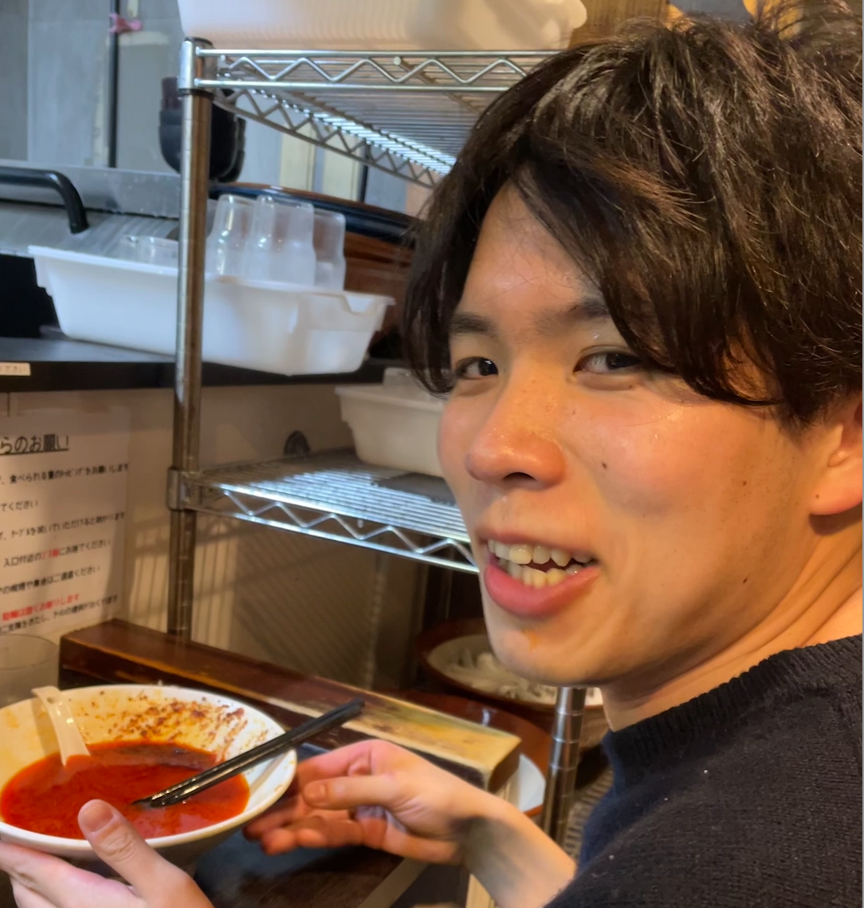

+++
title = "About me"
+++

Hello! My name is Sho Takishita,  and I am an AI researcher  (。ò ∀ ó。).  
I am interested in Knowledge, Commonsense/Causal Reasoning.  

<!--  -->

## Affiliation
- Researcher at Fujitsu Laboratories Ltd.
- Research Fellow at Mohamed bin Zayed University of Artificial Intelligence [Apr. 2024-]

<!-- ## Email
- Work: takishita.sho [at] fujitsu.com
- Private: sho.takish [at] gmail.com -->

## Research Topics
- Natural Language Processing (Commonsense, Causal Reasoning)
- Analysis of Large Language Models
- (currently working on) Bioinformatics
- (previous) Emoticons's sentiment analysis, Relation Extraction

## Work Experience
- Apr. 2020 - Present: Researcher at Fujitsu Laboratories Ltd.
- Jul. 2019 – Mar. 2020: Research Trainee at RIKEN AIP
- Oct. 2018 – Mar. 2019: Machine Learning Engineer at SERAPH Corporation

## Education
- Apr. 2018 – Mar. 2020:   
　M.Eng. in Information Science at Hokkaido University  
　Advisors: Prof. Kenji Araki, Dr.Zepka Rafal
- Apr. 2016 – Mar. 2018:  
　B.Eng. in Information Science and Technology at Hokkaido University  
　Advisor: Prof.Mineichi Kudo
- Apr. 2011 – Mar. 2016:  
　A.Eng. in Information Engineering at Kagawa National College of Technology    
　Advisor: Dr.Noriyuki Okumura

<!-- ## Awards
- Jul. 2015: Imagine Cup 2015 World Championship: Japan Representative@Team
- Apr. 2015: Imagine Cup 2015 Japan Competition: Best Award@Team
- Oct. 2014: National College of Technology 25th Programming Contest: Best Award@Team -->
